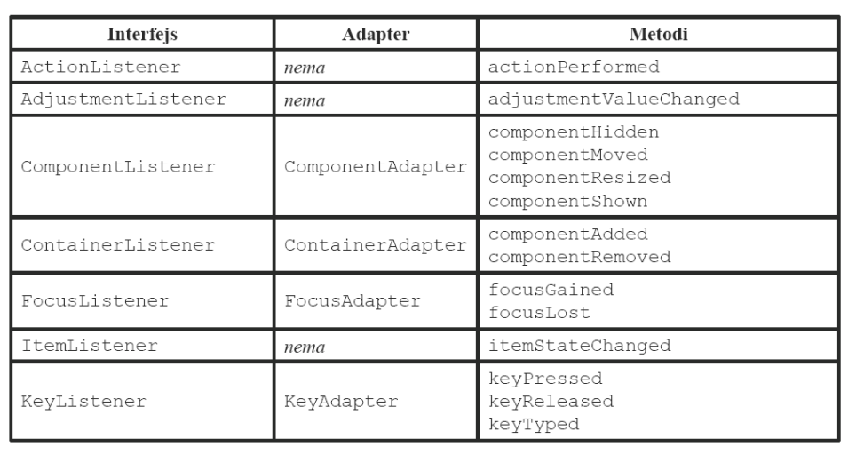

# GUI (Graphical User Interface) u Java programskom jeziku

- [GUI (Graphical User Interface) u Java programskom jeziku](#gui-graphical-user-interface-u-java-programskom-jeziku)
  - [Uvod](#uvod)
  - [Otvaranje slike](#otvaranje-slike)
  - [Grafičke komponente](#grafičke-komponente)
    - [Component](#component)
    - [Container](#container)
    - [Frame](#frame)
    - [Dugmići](#dugmići)
    - [Dijalozi](#dijalozi)
    - [Dijalog poruke](#dijalog-poruke)
    - [Da-ne dijalog](#da-ne-dijalog)
    - [Tekst komponente](#tekst-komponente)
    - [Liste komponente](#liste-komponente)
  - [Raspoređivanje komponenti](#raspoređivanje-komponenti)
    - [Menadžeri postavke](#menadžeri-postavke)
  - [Događaji](#događaji)
    - [Mouse listener](#mouse-listener)
    - [MouseEvent](#mouseevent)
      - [MouseEvent fildovi](#mouseevent-fildovi)
      - [MouseEvent metode](#mouseevent-metode)
    - [Obrada unosa sa tastature](#obrada-unosa-sa-tastature)
    - [KeyEvent](#keyevent)
      - [KeyEvent fildovi](#keyevent-fildovi)
      - [KeyEvent metode](#keyevent-metode)

## Uvod

Aplikacije koje imaju samo tekstualni ulaz i izlaz nazivaju se **konzolnim aplikacijama**.  
**GUI (Graphical User Interface)** je digitalni interfejs sa kojim korisnik interaguje preko grafičkih komponenti kao što su dugmići, meniji, polja za unos teksta, padajuće liste, ...

Neki od paketa za GUI programiranje u Javi:

- **java.awt**
- **javax.swing**
- javafx (ovaj paket se ne koristi na vežbama i neće biti potreban za kolokvijum)

Ceo GUI se sastoji iz tzv. grafičkih komponenti.
Grafičke komponente koje se pojavljuju na ekranu nazivaju se i kontrole ili "vidžiti“.
Neke kontrole:

- ekranski tasteri (button)
- radio-dugmad (radio-button)
- polja za potvrde (checkbox)
- klizači(scrollbar)
- polja za tekst (text box)
- liste (list)
- padajuće liste (combo-box, choice)

Svaki deo grafičkog interfejsa je implementiran kao klasa nekog GUI paketa.

## Otvaranje slike

U Javi možemo učitati sliku sa neke lokacije, smestiti je u neki objekat i posle je koristiti, tako što ćemo najčešće da je postavimo na neko dugme.

```java
// otvaranje slike
ImageIcon icon = new ImageIcon("putanja/do/slike"); // ili new ImageIcon(getClass().getResource("putanja/do/slike"))
```

**Potrebno je obratiti pažnju na putanju do slike, jer konstruktor može da baci RuntimeException.**

[ImageIcon zvanična dokumentacija](https://docs.oracle.com/javase/8/docs/api/javax/swing/ImageIcon.html)

## Grafičke komponente

**Uprošćen dijagram klasa osnovnih GUI klasa**


### Component

Klasa [**Component**](https://docs.oracle.com/javase/8/docs/api/java/awt/Component.html) je zajednička osnovna klasa za sve GUI kontrole i reprezentuje nešto što ima poziciju,veličinu,može se iscrtati na ekranu i prihvata ulazne događaje.  
Neke metode, koje ćete koristiti na kolokvijumu:

- `public add` - pogledati [Raspoređivanje komponenti](#raspoređivanje-komponenti)
- `public Color getBackground()` - geter za pozadinu komponente
- `public void setBackground(Color c)` - seter za pozadinu komponente
- `public void setBounds(int x, int y, int width, int height)` - pocetak prozora ce biti u tacki (`x`, `y`) u odnosu na gornji levi ugao ekrana, sirina ce biti `width` a visina `height`
- `public void setBounds(Rectangle r)` - svi gorenavedine parametri su "upakovani" u instancu klase **Rectangle**
- `public void setVisible(boolean b)` - prikazuje ili sakriva komponentu
- `public void setSize(int width, int height)` - setuje veličinu
- `public void setPreferredSize(int width, int height)` - setuje željenu (najčešće minimalnu) veličinu

### Container

Klasa **Container** je izvedena iz **Component**.
Objekti svih klasa izvedenih iz klase Container mogu da sadrže druge objekte iz bilo koje klase koja je izvedena iz klase Component.
Kako Container nasleđuje Component, sledi da kontejneri mogu da sadrže druge kontejnere.
**Izuzetak je klasa Window i njene potklase**, jer one ne mogu biti sadržane u drugom kontejneru.  
Neke metode ove klase, koje čete koristiti na kolokvijumu, možete pogledati u sekciji [Raspoređivanje komponenti](#raspoređivanje-komponenti).

### Frame

Klasa **Frame** je izvedena iz **Window**.
Koristi se za kreiranje glavnog prozora aplikacije.
Objekat tipa Frame može da sadrži traku menija i da prikaže naslov. **JFrame** je **swing** verzija Frame klase. Samostalna GUI (swing) aplikacija, što se grafičkog dela
tiče, najčešće sadrži jedan JFrame u koji se smeštaju
kontrole. **contentPane** je Container koji zauzima centralni deo
prozora i u njega se, najčešće, izuzimajući menije,
smeštaju komponente (dugmići, padajuće liste itd.)

- `public void pack()` - Ova metoda prilagođava veličinu prozora (Window) tako da odgovara njegovom sadržaju. Na primer, ako imate prozor sa sadržajem koji se dinamički menja, pozivanjem pack() će automatski prilagoditi veličinu prozora kako bi se sve komponente sadržaja mogle videti bez potrebe za scroll trakama.

**Primer kreiranje custom JFrame klase**

```java
import java.awt.*;
import javax.swing.*;

public class MyFrame extends JFrame {
    public MyFrame() {
        super("Naslov"); /// ili setTitle("Naslov");
        setBounds(100, 200, 500, 600); // pocetak prozora ce biti u tacki (100, 200) u odnosu na gornji levi ugao ekrana, sirina ce biti 500 a visina 600
        setDefaultCloseOperation(EXIT_ON_CLOSE); // kada se zatvori prozor, program prekida izvrsavanje
        setVisible(true); // prozor treba biti vidljiv
    }
}
```

### Dugmići

**JButton** – regularno dugme

- Neke metode, koje ćete koristiti na kolokvijumu:  

  - `public String getText()` - geter za tekst koji je postavljen na dugme
  - `public void setText()` - seter tekst dugmeta
  - `public Icon getIcon()` - geter za ikonicu koja je postaljena na dugme
  - `public void setIcon(Icon icon)` - seter za ikonicu koja se postavlja na dugme
  
**JCheckBox** – dugme sa checkbox-om sa leve strane  
**JRadioButton** – dugmad koja operišu u grupi, tako da je samo jedno dugme pritisnuto u datom trenutku. Ovo
grupisanje se postiže dodavanjem JRadioButton objekta ButtonGroup objektu

### Dijalozi

### Dijalog poruke

```java
JOptionPane.showMessageDialog(null, "Poruka"); // otvara dijalog i prikazuje poruku
```

### Da-ne dijalog

```java
int status = JOptionPane.showConfirmDialog(null, "Poruka", "Naslov", JOptionPane.YES_NO_OPTION); // otvara Da-ne dijalog

if (status == JOptionPane.YES_OPTION) {
  // korisnik je odabrao "DA" opciju
}

if (status == JOptionPane.NO_OPTION) {
  // korisnik je odabrao "NE" opciju
}

if (status == JOptionPane.CANCEL_OPTION) {
  // korisnik je zatvorio dijalog
}
```

### Tekst komponente

**JLabel** – pasivna komponenta, ne može se editovati, služi za označavanje drugih komponenti. Gorenavedene metode koje postoje u klasi **JButton** postoje i u klasi JLabel.  
**JTextField** – kao JLabel samo se može editovati. Predstavlja jednu liniju teksta.  
**JFormattedTextField** – to je JTextField komponenta koja ima kontrolu formata podataka koji se
unose/prikazuju.  
**JTextArea** – komponenta koja dozvoljava unos višelinijskog teksta. Ne podržava direktno
skrolovanje, ali to se može postići stavljanjem komponente JTextArea u kontejner JScrollPane

### Liste komponente

**JList** – definiše ograničenu listu stavki  
**JComboBox** - dopušta korisniku da izabere jednu stavku iz padajuće liste. [Zvanična dokumentacija](https://docs.oracle.com/javase/8/docs/api/javax/swing/JComboBox.html). [Tutorijal](https://www.codejava.net/java-se/swing/jcombobox-basic-tutorial-and-examples)  
NAPOMENA: Klasa JComboBox je **generička**. E je tip koji se prosleđuje kao parametar generičkoj klasi (može biti String, Object, ...). Primer: new JComboBox&lt;String&gt;( );

- Neke metode, koje ćete koristiti na kolokvijumu:
  - `public void addItem(E item)` - dodavanje stavke koju korisnik može da izabere u combo box
  - `public E	getItemAt(int index)` - vraća stavku koja se nalazi na indeksu *index*. Indeksi kreću od 0.
  - `public int	getItemCount()` - broj stavki u combo box listi
  - `public int	getMaximumRowCount()` - maksimalan broj stavki koji se može videti u listi bez skrolovanja
  - `public int	getSelectedIndex()` - indeks selektovane stavke
  - `public Object getSelectedItem()` - odabrana stavka
  - `public void insertItemAt(E item, int index)` - ubaci element na određeni indeks
  - `public void removeAllItems()` - ukloni sve stavke
  - `public void removeItemAt(int anIndex)` - uklanja stavku na indeksu *anIndex*
  - `protected void	selectedItemChanged()` - metoda koja se poziva kada korisnik promeni odabranu stavku
  - `public void setEditable(boolean aFlag)` - podešava da li korisnik može ručno da unese vrednost ili ne
  - `public void setEnabled(boolean b)` - podešava da li korisnik može da izabere drugu vrednost ili ne
  - `public void setMaximumRowCount(int count)` - setuje maksimalan broj stavki koje korisnik može videti u listi bez skrolovanja
  - `public void setSelectedIndex(int anIndex)` - setuje indeks selektovane stavke
  - `public void setSelectedItem(Object anObject)` - setuje selektovanu stavku

## Raspoređivanje komponenti

Kontejner je objekat svakog tipa koji kao osnovnu klasu ima **Container** klasu.  
Kontejner sadrži:

1. **komponente**  
    Komponente unutar kontejnera se prikazuju unutar površi koju zauzima kontejner na ekranu.  
    Komponente su smeštene u listu, pa imaju svoje indekse.

    - `public int getComponentCount()` – vraća broj komponenti u kontejneru
    - `public Component getComponent(int index)` – vraća komponentu koja se identifikuje datim indeksom. Radi se o indeksu niza, pa mora biti
    u opsegu [0, count-1].
    - `public Component[] getComponents()` – vraća niz komponenti iz kontejnera
    - Nekoliko verzija `add()` metoda – dodavanje komponete kontejneru
      - `public Component add(Component c)` – dodaje komponentu c na kraj liste komponenti sačuvane u kontejneru. Vraća se c.
      - `public Component add(Component c, int index` – komponenta se smešta na datu poziciju. Ako je index -1 komponenta se
dodaje na kraj liste, u suprotnom indeks mora biti ne manji od 0 i manji od trenutnog broja komponenti u kontejneru.Vraća
se c.
    - `public void add(Component c, Object constraints` - ograničenja specifična za menadžer postavke
    - `public void add(Component c, Object constraints, int index)`

2. **menadžera postavke**  
    Menadžer postavke je objekat neke od klasa tipa **LayoutManager**. On sadrži opis načina raspoređivanja komponenti u kontejneru.  

    - `void setLayout(LayoutManager mgr)` - setuje LayoutManager-a za kontejner
    - `LayoutManager getLayout()`

### Menadžeri postavke

Svi kontejneri imaju podrazumevani layout manager, ali se može izabrati drugačiji kada je potrebno. Layout manager određuje poziciju i veličinu svih komponenti u kontejneru.

Menadžeri:

- **FlowLayout** – dodaju se komponente u sukcesivnim redovima – kad je red popunjen, počinje se sa novim; podrazumevan za JPanel. Moguće je promeniti poravnanje FlowLayout-a sa setAligment(FlowLayout.&lt;TipPoravananja&gt;). Podrayumevano poravnanje je CENTER.  
- **BorderLayout** – prozor je podeljen na 5 delova – north, south, east, west, center; podrazumevani za contentPane u JFrame-u,
JDialog, JApplet. Ograničenja koja mogu biti korišćenja prilikom dodavanja komponenti su:

  - BorderLayout.NORTH
  - BorderLazout.SOUTH
  - BorderLayout.EAST
  - BorderLayout.WEST
  - BorderLayout.CENTER

![Border Layout](data:image/jpeg;base64,/9j/4AAQSkZJRgABAQAAAQABAAD/2wCEAAoHCBASDxEREBQUDxIRDxIREQ8PERUPEREQGBwcGRgUGBgcIy4mHB4rHxoYJkYmOC8xNTU1GiU7QDszPzA0NTEBDAwMEA8QHhISHzUhISs1NDE0NDQ0NDQxNDE0NDE1MTQ0NDQ0OjQ0NDE0NDE0NDQ0NDQ0NDE0NDQ0NDQ0NDExNP/AABEIAJ0BQQMBIgACEQEDEQH/xAAbAAACAwEBAQAAAAAAAAAAAAAABQMEBgIHAf/EAEUQAAEDAwAGBAwEBAYBBQEAAAEAAgMEERIFExUhVJMUMVPSBhYiJEFRdJKUsbLRI2FyczKBkaEzQlVxdaJSFzSjwvEH/8QAGAEBAQEBAQAAAAAAAAAAAAAAAAECAwT/xAAfEQEBAQEBAQEAAwEBAAAAAAAAEQESIQIDMUFREwT/2gAMAwEAAhEDEQA/ANhNVRTASzsNQX/iRxvcRHCw3xAaDbLE73em/qUHmvCQ/wBD91NohuIpHHqLYR/0Cc1ekwJ2MY5gAN3eU3eRcOafTut1ddyFr6+s+c/imZu6QWpeEi/ofuvtqXhIvdP3TDST2Sz3YQ5upjILeo3c8f8A1WR0VpiWSWNrzG5j3VYeGxvjMIidZri9zyH3HoAHXf0Lebif0e2peEi90/dfbUvCRe6fuqL9M0rWOe5z2taxj/Kjdd7HuDGvaLXc25Ckn0gxrbBrzI5kj2RmNxfiwb3Fvobcjf8AmlwWbUvCRe6fuvtqXhIvdP3SvR+mWOp4JJdz308M0urY4xx6wCxcd+Iv6z6FaiqmzOfHTuIeyR8b5HwufG17LZN623O/rulwWrUvCRe6fui1LwkXun7pTojSEjqbpNS5mJkfE1kUL2uL2vLG2Jc7Im3Vb0q2dKwZNYMzI4yDVBjjI0stmC30WuFfBbtS8JF7p+6LUvCRe6fuqujq7XTVMWDm9HkDMyPJd5LXX/L+LqTLo5TwV7UvCRe6fui1LwkXun7qx0co6OU8Fe1LwkXun7otS8JF7p+6sdHKOjlPBXtS8JF7p+6LUvCRe6furHRyjo5TwV7UvCRe6fui1LwkXun7qx0co6OU8Fe1LwkXun7otS8JF7p+6sdHKOjlPBXtS8JF7p+6LUvCRe6furHRyjo5TwV7UvCRe6fui1LwkXun7qx0co6OU8Fe1LwkXun7otS8JF7p+6sdHKOjlPBXtS8JF7p+6LUvCRe6furHRyjo5TwV7UvCRe6fuuXGkAJNJCAN5OJ+6tdHKgq4SI5D6mEp4JWULHAEaOaQRcXaBu/2Lty+nR7ALnRzbf7N76bGpPrR0k+tZ9CCIUshDWUTHuNzi1huLbje5FrHcrWzm/6c3+je8jQ+6pdvPlvmHX6NeQltNBpKWOOVuknMbIxsjWGCnJa1wuGn8H0XsrouzwQx46yhYwOOIc5txl6rhxsoY3Ur74ULHgG2TWi393BSwyTmk1dRJr5G1ZjdJixuQZOWtNmtaP4QPQEloZowcZXPYwOf5cUjozG65s+w3OA/8XXafSDZcv0+9+cyPR+H5Z+mbu/0caqH/T2/0b3l3RzQ3caeM0kzTucwkNc4C4ZIy9nNP/5YqvXQOhbeokL3OF6dkL3xBwFvxXkWNuryN43777rRaDBe+R3XZ8Y/sVn5+93Z9On1+Pz/AM9+/kx/9QIexk/q37r6vPULvzjxvTaOjeaOkfG3NzWQPLAQ0uaGWIBJAvvUEuj6l0hk1Dw4m4/gsN1uoVIF/wCSr6MdVSvbDHMYWx0VI8DAP/iY246wmWza7izyR3ln1NjvR2jXB73GMwM1cUbI3Oa5xLS9znHFzhvzHpvuKSxeA8h1cc07H08U88zGRwuilzkyFnPL3BzQ17xYBvoPosW+za7izyR3kbNruLPJHeUhSaXwGlkjcySoaXNhZBC9sBbjEyRr/wARuflPOABcCB6h62elfByWSVk1PKyGQQvhe2aJ08b2O33s17CHAjrvbf1KbZtdxZ5I7yNm13FnkjvJCklN/wDz/DUgvilDaeGCds1PnnqxYOYcvIJ6iCHDcLWO9PdD+D5p9eM8xNVSVDfJwwD7eR1m9rdfp9QXOza7izyR3kbNruLPJHeSFLvEq9CaV0gLm1L6iOUx3aHl5ka1zCfKG/E7xcX6vRHWeBDn07Y2Pponlz3vkZSuBD3ADWREPBY8AEXJdcHfeya7NruLPJHeRs2u4s8kd5IVHo3wckgqJpBI2SOoLXyMcx2tErWtbkHh1i2zerG9z1+hN+gJZs2u4s8kd5Gza7izyR3lfSmfQEdASzZtdxZ5I7yNm13FnkjvJC4Z7PRs9LNm13FnkjvI2bXcWeSO8npcM9no2elmza7izyR3kbNruLPJHeT1fDPZ6Ogfkk76WqaSHVzQR1gxtBH/AGXzo9TxzeW3vJNS4c7PRs9Juj1PHN5be8jo9TxzeW3vJNLhzs9Gz0s2bXcWeSO8jZtdxZ5I7yk0uGez0bPSzZtdxZ5I7yNm13FnkjvK+lwz2ejZ6WbNruLPJHeRs2u4s8kd5PS4Z7PRs9LNm13FnkjvI2bXcWeSO8npcM+gKppWhIppiBciJ5AAuTuKr7NruLPJHeRs2t4v/wCEd5IVnK+aKbAiplpi1rg4Qi7X3JIJs9u+27qXVLXMYxrDMZsb/iSeS9wJJ3jI+u3WepPNhVPbs+FZ9182FU9uz4Vn3W7hVBlSIhTTPuGv1zrkWuNcXD+ZG9LIJ3RsbGyrjwY0MblQOLsQLC5FSATu67BaV+h6pwAdUtcB1A07SB/K642FU9uz4Vn3UzcKU6PmD5GR5iZ8lTrHOZGYhdz9Y6zcnYgb/wDMepII6xtPUuMjQ50ckmEcjsGtly8mRzbeVjvIHVvv1gFbZmhqppu2oa0+ttM0H+xQ/QdS43dUMcT1l1Mwk/zJWPv5sej8P2z87cuaxsmn9ZHLHO4Sh93scXYvhm9EjDb/AK9RG7qJB0PgPDnHO+xtm3E+g2bvt61f2BUduz4Vn3UckdVTS0rTMHslqWsLGxtjAHWeorGfnNtdP1/9Pz9fO/PzkrzqyFIhdnjj0DwXcBUvv/p9F9DVqtcFjdBvtUH2Cj+hqfa1TmpuzTTXBGuCV61GtTlOjTXBGuCV61GtTk6NNcEa4JXrUa1OTo01wRrgletRrU5OjTXBGuCV61GtTk6NNcEa4JXrUa1OTo01wRrgletRrU5OjTXBGuCV61GtTk6KK/wq6NpGSmexurfBrmykkWlxs1rvQGnC1/WVPo/wvhfFA6RrmvfDTyTGMB0UDp9zGvcTfeb9QP5qhpLQ0M81Q+VzvxqdtOWBmQaGkPDwbfxXP9lBD4OwMaxgkeWYUrJWln+L0c3jcTbyT67epOV6w0qPDBuMToYJZGyVzaPN2rY3PIh2Pl3J8l1uofmuaXwpZK18UjTHJJLWQRFoJidqct2R/wA2IvuFvRdVG6HjEMcYkf8AhVprGPLCbSF7n4kW3t8twXDdCxs1bmve4wz1U7Wlm5z52uBad24DIpnyb9ZG2Mw/JGuCVmVGtTlOjTXBGuCV61GtTk6NNcEa4JXrUa1OTo01wRrgletRrU5OjTXBGuCV61GtTk6NNcEa4JXrUa1OTo01wRrgletRrU5OjTXBGuCV61GtTk6NNcEi8IXgzaPtxjfkrOtSzSsl6ih9rb8k5i2vPEIQitnoulfJPZkhiIoKMktY19xg3dvTbZU/Eu5TFU8Ghepf7BRfQ1abFWxNwk2VPxLuUxGyp+JdymJ3ijFKnJJsqfiXcpiNlT8S7lMTvFGKU5JNlT8S7lMUFfRTxwvkFQ52rYXYmJgvb0XWixVHTrfNKj9pyU5UGaMnLQeku3gH/CZ6V1sqfiXcpicwt8hn6G/JdYpTkk2VPxLuUxGyp+JdymJ3ijFKckmyp+JdymI2VPxLuUxO8UYpTkk2VPxLuUxGyp+JdymJ3ijFKckmyp+JdymI2VPxLuUxO8UYpTkk2VPxL+UxGypuJdyWJ3ijFKckmypuJdyWI2VPxLuTGneKMUpySbKn4l3JjRsqfiXcpid4oxSnJJsqfiXcpiNlT8S7lMTvFGKU5JNlT8S7lMRsqfiXcpid4oxSnJJsqfiXcpiNlT8S7lMTvFGKU5JNlT8S7lMRsqfiXcpid4oxSnLP1dBPHFI/pDnYRvfjqmC+IJt/ZdU+jp3sY/pDhmxrraphtcA2TPSzfNaj2eX6CpKBv4EP7LPpCU5K9lT8S7lMRsqfiXcpid4oxSnJJsqfiXcpiNlT8S7lMTvFGKU5JNlT8S7lMVKspHx1FEXymUGrYAHMayx9e5ajFJtOi02j/bG/JKZjzRCEKNPQfBYecv8A+PovoatVisv4J/8AuX/8fRfQFrbhZ3VRYoxUt0XUoixRipbhFwlEWKX+EDfM6j9pya3CW+EJ8yqP2XJTVqBnkM/Q35LvFfac+Qz9DfkpLhKIsUYqW4RcJRFijFS3CLhKIsUYqW4RcJRFijFS3CLhKIsUYqW4RdKIsUYqW4RcJRFijFS3CLhKIsUYqW4RcJRFijFS3CLhKIsUYqW4RcJRFijFS3CLhKF2mG+a1Ps0v0OUmjm+bw/sx/SF800fNKn2aX6XKTRp83h/Zj+kKiXFGKlui6lEWKMVLcIuEoixSLwibabR/trfktFdIPCX/G0f7a35Jm+jy5CELY9A8GDapf8A8fRfQ1arNZLwbNqh3sFF9DVpc1NxKJq6NkkcbnBr5i4RtIPllou4A9Q3b1TZ4Q0bo3yNmaY4phBI6zvJlJDQy1rk3IH80r8M6WeSnjfSsMk9PO2SNgIBcCCxwuT6nE/yWdp/BipiqaWNjD0d/R56qTIWbUwtf1i97uc4dXqCivS8ioJ6pjHMa9wY6R5ZG09b32LiAPTuBP8AJefU2gKjU1THsmD5KWSOYwtjYaqTO4dk55zeQCLmws7FfaHQMolpHvpo8IK5z8mRsjc6MssHmK5awh+JONhduVrpmep/T0bNLtPu8zqP2nKzmqOnHeaT/tOVhTKB/kM/Q35KTNVYX+Qz9Dfkus0hVjNGar5ozSFWM0ZqvmjNIVYzRmq+aM0hVjNGar5ozSFQVumaaF+EsgY7APcMXuDWE2DnloIa2+65sOv1K8H3FxvB6iN4KzLGTU9dVzCJ9QyqbTlmrLfw3Mbg5jsiMR/mv+ZSqXRFSa+WVzXFzqhz2TMaw+bGLHUueXXwvcYAdZBUVt6qrjiY6SVwYxv8T3bgN9gPzNyBb81LdeUT+C9SYIWCn3jRkTZWuwN6lk7HBpud7xHrAPRZxFxdPZNEznSAlwe0CeF8MkbGAxU7WWdC55cC1nWCwNN8gkNbouKM1mvAvRxptHwsfGIZcSZWgNDi+5tkW9e6ye5qxKsZozVfNGaQqxmjNV80ZpCrGaM1XzRmkKsZozVfNGaQqPTDvNan2eX6CpNHu83h/Zj+kKrpV3mtR7PL9BXdA/8AAi/Zj+kJCrks7WMc9xs1jS5zvU0C5Kq0GlYagAwl7mlge15hljY5p6nNe9oDgbjqK40i1z6eZjRk58MjWtHpcWkALK0tLVN0ZHBq5pJGU8DHU9S2IwNtiHhgbYvsL2a5xBtvUit3cqBtXGZHxBwMjGNc9gN3Ma6+JPqvif6LzbxenML2GF+DNITyQQvip5ITG+NoDnwghoaXZi7bFpceq9088GdFyRVks0sDYjJRUzQ9lnhj25CVmZJdc+R/viN+5MxNbPNI/CE3m0f7Y35Jpmk+nDeeg9sb8lcwrzVCEKq3fg+fOHf8fRfQ1aHJZvQZ84PsFH9DU/yWmN/lLkjJRZIySJUuSMlFkjJIVLkqWmneaz/tuVjJUtMO81m/bckKvwu8hv6G/Jd5KvE7yG/pb8l3kkKlyRkoskZJCpckZKLJGSQqXJGSiyRkkKlyRkoskZJCpckZKLJGSQqXJGSiyRkkKlyRkoskZJCpckZKLJGSQqXJGSiyRkkKlyRkoskZJCpckZKLJGSQqLSjvNp/2JPpK7oXfgxftR/SFBpN3m8/7En0ldUTvwY/2o/pCQq5kjJRZIySFS5IyUWSMkhUuSU6YP49B7Y35JjklelT5xQ+1t+SRc3154hCFltttDH8c+wUf0NTvJItFH8c+wUf0NTjJbzPHL631LkjJRZIyViVLkjJRZIySFS5KppZ3m036HKbJVNKu83l/QUhV6J3kN/SPkuslXjd5Lf0j5LvJIVLkjJRZIySFS5IyUWSMkhUuSMlFkjJIVLkjJRZIySFS5IyUWSMkhUuSMlFkjJIlS5IyUWSMkhUuSMlFkjJItS5IyUWSMkhUuSMlFkjJIVLkjJRZIySFR6Rd5vN+zJ9JXdG78KP9tn0hQV7vwJf2pPpK6pHfhR/ts+kJCreSMlFkjJIVLkjJRZIySFS5JdpE+cUPtbPkrmSX1x84ofa2fJTc8X531g0IQsOra6HoGzTlrnPZjQUZvG8sJuxo32TvxdZ2k/OKXeDL8al/wDx9F9DVqOkpdTcwo8XWdpPzijxdZ2k/OKb9JR0lS6kwo8XWdpPzijxdZ2k/OKb9JR0lL9Ewo8XWdpPzivjvBuMggvnIO4gykghOOko6Sl+iYUeLrP/ADn5xR4us7SfnFN+ko6Sl+iYUeLrO0n5xR4us7SfnFN+ko6Sl+iYUeLrO0n5xR4us7SfnFN+ko6Sl+iYUeLrO0n5xR4us7SfnFN+ko6Sl+iYUeLrO0n5xR4us7SfnFN+ko6Sl0mFHi7H2k/OcjxdZ2k/OKT6e05Uw1bta+ampCyPU1EEMU8If1v14c0uG/duLQB6bq2/wvtK5ojDo21JpNaHkOdOI9ZcMt/B6L3v+Sdac4u+LsfaT85yPF1naT84rN6U8N6jo0ToY2RyTUUdVm95eI8pWRFrRj5R8sbz/Q9RuR+E9RHUzNlAljOkoKRti1upErGWDbNu8ZEm59f8kurvzmHHi6ztJ+cUeLrO0n5xTfpKOkpfpJ8lHi6ztJ+cUeLrO0n5xTfpKOkpfomFHi6ztJ+cUeLrO0n5xTfpKOkpfomFHi6ztJ+cUeLrO0n5xTfpKOkpfomFHi6ztJ+cUeLrO0n5xTfpKOkpfomFB8HIyCC+cg7iDKSCPUUDwcjAsHzgDcAJjYBN+ko6Sl+iYUeLrO0n5xR4us7SfnFN+ko6Sl+iYUeLrO0n5xR4us7SfnFN+ko6Sl0mFHi6ztJ+cUv0joxsNRQua+R+VW0fiSF4G6+4FabpKS6flyn0f7Y35K3SY8zQhCK22hX2nPsFH9DU91qwW1YHavKKXLUxRlzKrVghjAAbBn5etG0qfs6j409xaxNz1vdajWrBbSp+zqPjT3EbSp+zqPjT3FfE51vdajWrBbSp+zqPjT3EbSp+zqPjT3E8Jre61GtWC2lT9nUfGnuI2lT9nUfGnuJ4c63utRrVgtpU/Z1Hxp7iNpU/Z1Hxp7ieHOt7rUa1YLaVP2dR8ae4jaVP2dR8ae4nhzre61GtWC2lT9nUfGnuI2lT9nUfGnuJ4c63utRrVgtpU/Z1Hxp7iNpU/Z1Hxp7ieHOt7rUa1YLaVP2dR8ae4jaVP2dR8ae4nhzrXVejKeV73yNe4yNa17WyyMjka3qD2Ndi71bx+SNmU2t1uHl5ZfxPwzxwzwvjljuytdZHaVP2dR8ae4jaVP2dR8ae4pc/w53/AFpT4O0NrGIkaow2MkhtGXtfiPK3Wc1pBG8WFrKZ2h6UkksJLqmOqJMkhJnjADH/AMXoDRu6j6QsrtKn7Oo+NPcXzaVP2dR8ae4lz/F5+v8AW91qNasFtKn7Oo+NPcRtKn7Oo+NPcVqTW91qNasFtKn7Oo+NPcRtKn7Oo+NPcTw51vdajWrBbSp+zqPjT3EbSp+zqPjT3E8Odb3Wo1qwW0qfs6j409xG0qfs6j409xPDnW91qNasFtKn7Oo+NPcRtKn7Oo+NPcTwmt7rUa1YLaVP2dR8ae4jaVP2dR8ae4nhzre61GtWC2lT9nUfGnuI2lT9nUfGnuJ4c63utRrVgtpU/Z1Hxp7iNpU/Z1Hxp7ieHOt7rUt0m+9RQ+1t+Sym0qfs6j409xSU+lqdkjJBDM4xvEjQ+rybl/tgoZmkqFxkhRp//9k=)  

- **GridLayout** – komponente se raspoređuju u pravougaonu mrežu, pri čemu korisnik zadaje broj redova i kolona

Content Pane – kontejner, zauzime centralni deo prozora i
na njega se dodaju ostale komponente (dugmići, polja za unos...). U zavisnosti od potrebe komponente se grupišu tako što se dodaju nekom panelu, koji ima odgovarajući raspored, a onda se
paneli smeštaju u veći kontejner. JPanel predstavlja površinu na koju se mogu dodati druge komponente.

## Događaji

Događaj se može shvatiti kao signal (određenog tipa) koji se šalje programu kao informacija o tome da se
nešto desilo. Događaj se generiše nakon akcije koja nije desila od strane same aplikacije, kao što su akcija korisnika
(pomeranje miša, klik mišem i sl) ili signal poslat od strane OS-a. Java događaje generišu izvori(sources) događaja a obrađuju objekti klasa osluškivača(listeners) događaja.

Sistem delegiranja:

- Izvori događaja (npr. dugme) generišu objekat tipa događaj i šalju osluškivačima
- Svaki izvor događaja održava/ima sopstvenu listu osluškivača, za svaku vrstu događaja posebnu listu
- Da bi se neki osluškivač našao u listi nekog izvora mora se registrovati kod izvora
- Ovakav model obrade događaja se naziva delegiranje ili prosleđivanje(pravo obrade događaja se delegira svakom objektu koji implementira interfejs odgovarajućeg osluškivača)

Dva koraka u definisanju obrade:

1. definisanje osluškivača
2. registracija osluškivača kod izvora

Klase osluškivača mora da implemetira interfejs nekog osluškivača ili
da proširuje neku klasu koja implementira interfejs osluškivača.

Registrovanje instance klase osluškivača događaja kod izvora:

```java
izvorDogadjaja.addActionListener(listener); // listener je instanca klase koja implementira interfejs ActionListener
// ili
izvorDogadjaja.addMouseListener(listener); // listener je instanca klase koja implementira interfejst MouseListener
```

**Samo** komponente Button, List i TextField generišu **ActionEvent**. Sve komponente generišu **MouseEvent**.

*Standardni osluškivači*


Adapteri su klase koje implementiraju interfejs osluškivača događaja, tako da programer treba da prepiše samo one metode koje su mu potrebne, kako ne bi morao da implementira sve metode.

**Svi događaji** poseduju metode:

- `public int getID()` - vraća tip događaja
- `public Object getSource()` - vraća izvor događaja

### Mouse listener

Interfejs osluškivača miša predviđa 5 metoda:

- public void **mouseClicked**(MouseEvent d); //pritisnuto i otpušteno dugme. pozicija miša nije pomerena van dugmeta.
- public void **mouseEntered**(MouseEvent d); //kursor ušao u polje komponente
- public void **mouseExited**(MouseEvent d); //kursor izašao iz polja komponente
- public void **mousePressed**(MouseEvent d); //pritisnuto dugme
- public void **mouseReleased**(MouseEvent d); //otpušteno dugme

### MouseEvent

[Zvanična dokumentacija](https://docs.oracle.com/javase/8/docs/api/java/awt/event/MouseEvent.html)

#### MouseEvent fildovi

- `public static int BUTTON1` - levi klik
- `public static int BUTTON2` - klik na scroll
- `public static int BUTTON3` - desni klik

#### MouseEvent metode

- `public int getButton()` - da li je korisnik koristio levi klik, desni klik ili klik na scroll
- `public Point getLocationOnScreen()` - x i y koordinate na ekranu
- `public Point getPoint()` - x i y koordinate relativne u odnosu na izvor događaja

### Obrada unosa sa tastature

```java
KeyboardFocusManager manager = KeyboardFocusManager.getCurrentKeyboardFocusManager();
manager.addKeyEventDispatcher(new KeyEventDispatcher() {
  
  @Override
  public boolean dispatchKeyEvent(KeyEvent e) {
    // TODO Logika
    return false;
  }
});
```

### KeyEvent

[Zvanična dokumentacija](https://docs.oracle.com/javase/8/docs/api/java/awt/event/KeyEvent.html)

#### KeyEvent fildovi

- `public static int VK_1` - dugme 1
- `public static int VK_A` - dugme A
- ...

#### KeyEvent metode

- `public char getKeyChar()` - ako korisnik pritisne dugme "A", vratiće "A". ako pritisne "1", vratice "1", ...
- `public int getKeyCode()` - vratiće KeyEvent.VK_1 ili KeyEvent.VK_A ili ...
